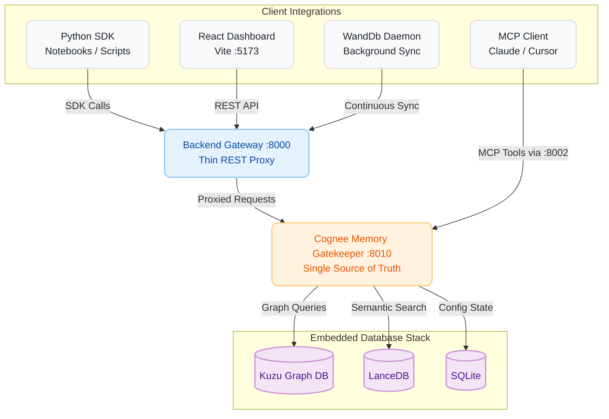

<div align="center">
  <h1>Groundhog</h1>
  **The Enterprise Memory-Graph Layer for Machine Learning Experiments**

  [](https://opensource.org/licenses/MIT)
  [](https://www.python.org/downloads/)
  [](https://github.com/topoteretes/cognee)
  [](https://reactjs.org/)
  [](https://modelcontextprotocol.io/)
  []()
  []()

  <p align="center">
    Groundhog sits on top of your existing ML workflow to capture, relate, and recall the complete context of your AI experiments. Stop wasting GPU hours on configurations you've already tried.
  </p>
</div>

---

## What is Groundhog?

Groundhog is an **experiment reproducibility and semantic memory platform**. Traditional loggers (like TensorBoard or standard WandDb setups) tell you *what* metrics a run achieved. Groundhog tells you *why*, *how it relates to past runs*, and *whether you should run it at all*. 

It leverages an embedded multi-modal database stack (Graph + Vector + Relational) to build an interconnected web of your ML experiments, datasets, hypotheses, and output artifacts.

### Key Capabilities

* **Pre-flight Guard (Compute Saver):** Instantly answers "Have we tried this config?" before you spin up expensive GPUs. Uses canonical config hashing (ignoring noise like `seed` or `output_dir`) to detect duplicate experiments.
* **Self-Improving Research Memory:** Not just a dumb log. It tracks the *rationale* behind choices and connects them semantically.
* **Semantic Artifact Discovery:** Ask "Where's the loss curve for the failed ResNet run?" and get the exact file path instantly.
* **MCP Agent Integration:** Exposes your ML memory directly to autonomous coding agents (Claude, Cursor) so they can query past results and learn from your team's mistakes.

---

## Architecture

Groundhog is built for local, secure, and lightning-fast execution. **No external Postgres required.** It uses an in-process, embedded database approach via Cognee.



### The Embedded Stack
* **Kuzu (Graph DB):** Maps the intricate relationships (`belongs_to`, `produced_by`, `used_dataset`) between your DataPoints.
* **LanceDB (Vector DB):** Handles dense vector embeddings (using local `fastembed`) to allow natural language queries over your research hypotheses.
* **SQLite:** Manages robust, ACID-compliant storage for projects and structural metadata.

---

## Model Context Protocol (MCP) Support

Groundhog natively implements the **Model Context Protocol (MCP)**, allowing cutting-edge AI assistants (like Anthropic's Claude Desktop or Cursor) to directly interface with your experiment memory. 

Through the `mcp_server` (running on port `8002`), your agent gets access to four primary tools:
1. `groundhog_check_config`: Validates if a proposed hyperparameter set has already been tested.
2. `groundhog_remember`: Ingests new completed experiments (and their reasoning) directly into the knowledge graph.
3. `groundhog_query`: Allows the AI to semantically ask questions about past experiment performance.
4. `groundhog_find`: Locates specific output artifacts (checkpoints, plots) from previous runs.

---

## Getting Started

### 1. Installation

Groundhog is designed to be lightweight and run completely locally.

```bash
# Clone the repository
git clone https://github.com/Team-Moov/cognee-hackathon.git
cd cognee-hackathon

# Setup virtual environment
python -m venv venv
source venv/bin/activate  # On Windows use: venv\Scripts\activate

# Install dependencies
pip install -r requirements.txt
cp .env.example .env
```

### 2. Configuration (`.env`)

Groundhog uses a flexible LLM backend. You can use Groq, Gemini, or AI/ML API. All vector embeddings run locally using `fastembed` (`BAAI/bge-small-en-v1.5`), ensuring high privacy and zero embedding costs.

```env
GROUNDHOG_LLM_PROVIDER=groq        # Options: groq | gemini | aimlapi
GROQ_API_KEY="gsk_your_api_key"    # Your provider key
```
*(Note: Cognee treats your `.env` as the absolute source of truth via `override=True`)*

### 3. Launching the Services

Start the ecosystem. It is recommended to use a terminal multiplexer (like `tmux` or `Windows Terminal` panes).

```bash
# Terminal 1: Core Memory Gatekeeper (MUST run only one instance)
python main.py

# Terminal 2: REST Backend API
cd backend && python -m uvicorn app.main:app --port 8000

# Terminal 3: React Dashboard
cd frontend && npm install && npm run dev

# Terminal 4: MCP Server (Optional, for AI agent integration)
python -m uvicorn mcp_server.main:app --port 8002
```

Navigate to **`http://localhost:5173`** to access the dashboard.

---

## Developer Guide: The Python SDK

Integrate Groundhog directly into your PyTorch, TensorFlow, or JAX training scripts with zero friction.

```python
import groundhog

# 1. Initialize with your project ID (grab this from the dashboard)
groundhog.init(project_id="proj_alpha_001")

config = {
    "model": "ResNet50",
    "learning_rate": 0.001,
    "batch_size": 64,
    "optimizer": "AdamW"
}

# 2. Pre-flight Check: Don't waste GPU time on duplicate runs!
if groundhog.check(config).get("already_tried"):
    print("Duplicate configuration detected. Halting execution to save compute.")
    exit(0)

# ... [Your actual ML training loop runs here] ...

# 3. Remember the Run
groundhog.remember(
    config=config,
    metrics={"val_accuracy": 0.942, "val_loss": 0.12},
    dataset={"name": "ImageNet-1k", "preprocessing": "CenterCrop", "quality": "Clean"},
    output_dir="./checkpoints/run_042",
    hypothesis="Using AdamW with a lower LR will smooth out validation loss spikes.",
    gpu_hours=4.2
)

# 4. Semantic Research Query
insights = groundhog.query("Which optimizer yielded the highest validation accuracy on ImageNet-1k?")
print(insights)
```

---

## WandDb Sync Daemon

Already using WandDb? Groundhog can seamlessly ingest your WandDb history to build its memory graph automatically.

```bash
python connectors/wandb_sync.py --project-id proj_alpha_001 --watch --interval 60
```
*Note: This parses `run.notes` for the rationale and requires `wandb` to be authenticated in your environment.*
