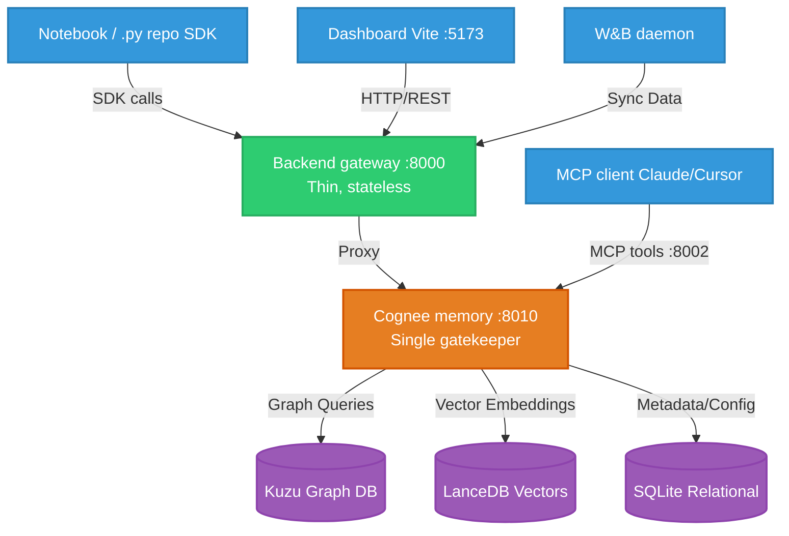

# Groundhog — ML Experiment Reproducibility & Memory


Groundhog is a **memory-graph layer for ML experiments**, built on open-source [Cognee](https://github.com/topoteretes/cognee). It sits on top of a researcher's existing workflow and answers the questions their tools don't:

- **"Have we tried this config, and what happened?"** — Pre-flight Guard blocks wasted compute.
- **"What have we learned, and where next?"** — a self-improving research memory, not just a log.
- **"Where's my checkpoint / plot / log file?"** — one-click artifact discovery.
- **"Is my coding agent about to repeat a mistake?"** — the same memory is queryable live over MCP.

Everything runs **locally** and open-source. No Cognee Cloud, no Postgres.

## Architecture & Implementation Details

Groundhog leverages an embedded, multi-modal database stack to orchestrate knowledge graphs, vector embeddings, and relational data without requiring external database servers like Postgres.

### Mermaid Architecture Diagram



### Database Stack (Embedded & In-Process)
- **Kuzu (Graph DB)**: Stores the semantic relationships between experiments, configurations, and artifacts.
- **LanceDB (Vector DB)**: Manages embeddings for semantic search over experiment hypotheses and conclusions.
- **SQLite (Relational)**: Stores structured metadata and project definitions.

*Note: In-process embedded DBs run directly within the Cognee gatekeeper process. This removes Windows lock contention and simplifies deployment by entirely eliminating Postgres.*

## Setup & Configuration

```bash
python -m venv venv
# Windows: venv\Scripts\activate   |   *nix: source venv/bin/activate
pip install -r requirements.txt        # includes fastembed + litellm
cp .env.example .env                    
```

### Choose an LLM Provider in `.env`

Groundhog uses **Groq, Gemini, or AI/ML API**. A single provider key powers the whole system. Embeddings default to a local `fastembed` model (`BAAI/bge-small-en-v1.5`), meaning no additional keys are required for vectorization!

```env
GROUNDHOG_LLM_PROVIDER=groq        # groq | gemini | aimlapi
GROQ_API_KEY="..."                 # set the key for your chosen provider
```

> **Note:** Cognee force-loads `.env` with `override=True`, so **`.env` is the source of truth**.

## Running the Stack

```bash
# 1. Cognee memory server (single gatekeeper)
python main.py                                   # → :8010

# 2. Backend gateway
cd backend && python -m uvicorn app.main:app --port 8000    # → :8000

# 3. Frontend dashboard
cd frontend && npm install && npm run dev        # → http://localhost:5173

# 4. (optional) MCP server for coding agents
python -m uvicorn mcp_server.main:app --port 8002
```

## Using the SDK (Notebooks & Python Projects)

```python
import groundhog                       
groundhog.init(project_id="proj_xyz123")  

# Pre-flight Guard (Canonical Config Hashing)
if groundhog.check(config)["already_tried"]:
    print("Already ran this config — skipping to save compute!")

# Record the FULL picture (auto-harvests git commits)
groundhog.remember(
    config=config,
    metrics={"val_accuracy": 0.91},
    dataset={"name": "CIFAR-10", "version": "v2", "quality_issues": "~2% mislabeled"},
    output_dir="./outputs",            
    hypothesis="lower lr improves convergence",
    gpu_hours=2.5,
)

# Semantic Querying
groundhog.query("What was the best val_accuracy so far and which config achieved it?")
```

## W&B Integration Daemon

Incrementally syncs new runs from Weights & Biases without hardcoded project names:
```bash
python connectors/wandb_sync.py --project-id proj_... --watch --interval 60
```

## Advanced Cognee Features

Groundhog makes full use of Cognee's powerful feature set:
- **Lifecycle Ops**: `remember` / `recall` / `improve` / `forget`.
- **Typed Graph & Real Edges**: DataPoints map to real `belongs_to` / `produced_by` edges.
- **Ontology Grounding**: Uses OWL ontologies (`ml_ontology.owl`).
- **Pipeline Tracing**: Native execution tracing with `enable_tracing`.

---
## License

MIT License. See `LICENSE` for more information.
