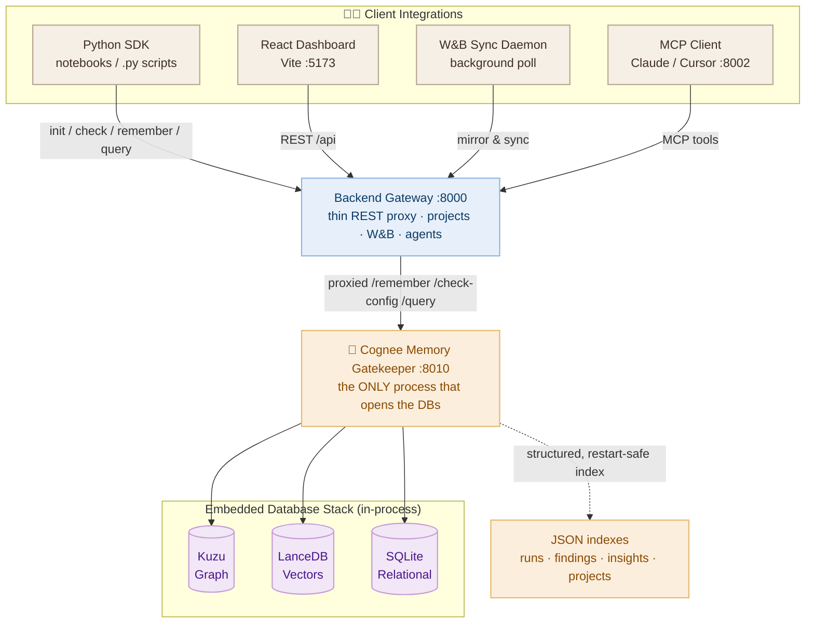
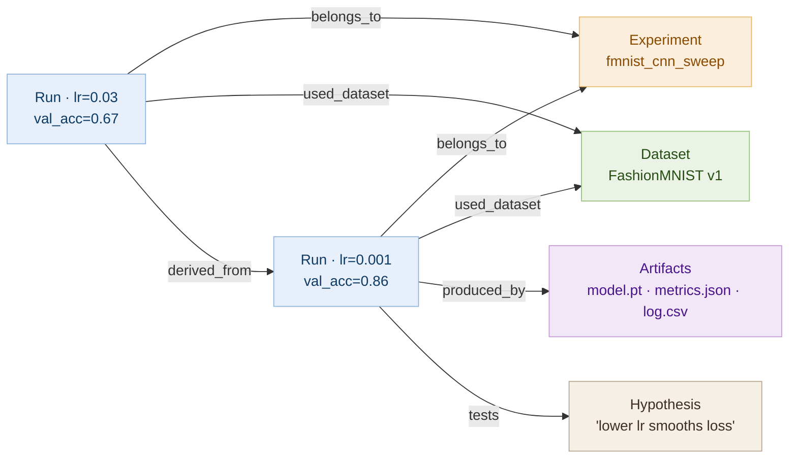
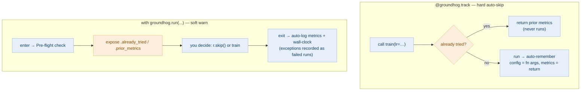
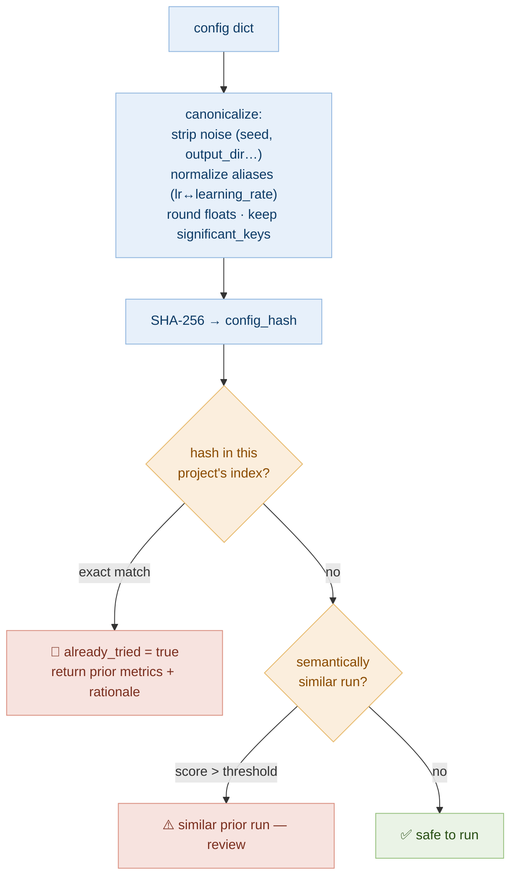
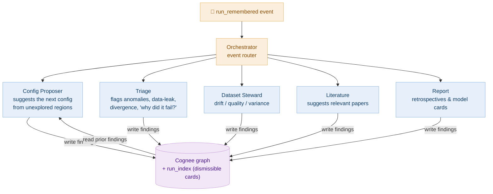
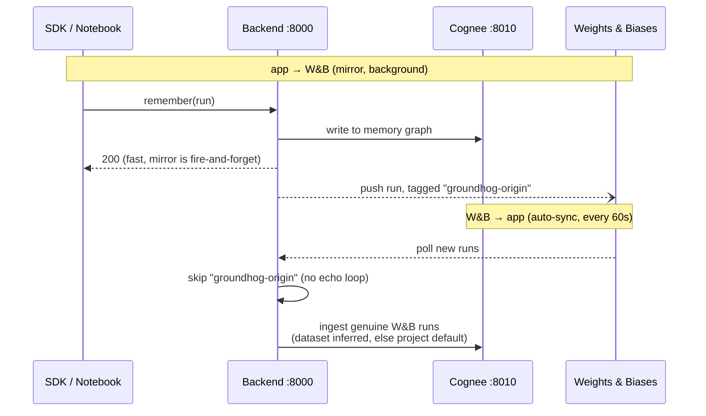
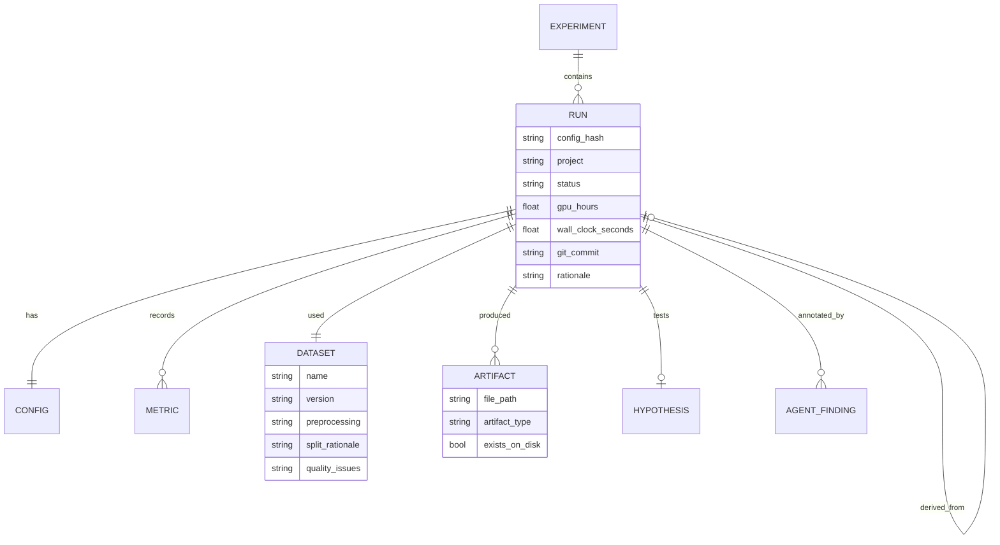

<div align="center">

#  Groundhog

**The Memory‑Graph Layer for Machine‑Learning Experiments**

*Stop re‑running experiments you've already tried. Turn a pile of runs into a memory that reasons.*

[](https://opensource.org/licenses/MIT)
[](https://www.python.org/downloads/)
[](https://github.com/topoteretes/cognee)
[](https://reactjs.org/)
[](https://modelcontextprotocol.io/)
[](https://wandb.ai/)

</div>

---

## Table of Contents

- [Why Groundhog?](#why-groundhog)
- [What it does](#what-it-does)
- [Screenshots](#screenshots)
- [System Architecture](#system-architecture)
- [How the Memory Works](#how-the-memory-works)
- [The Pieces](#the-pieces)
  - [Cognee Memory Gatekeeper](#1-cognee-memory-gatekeeper-8010)
  - [Backend Gateway](#2-backend-gateway-8000)
  - [Python SDK](#3-python-sdk)
  - [Pre‑flight Guard](#4-pre-flight-guard)
  - [Insights Engine](#5-insights-engine)
  - [Multi‑Agent System](#6-multi-agent-system-the-blackboard)
  - [MCP Server](#7-mcp-server-8002)
  - [Weights & Biases Integration](#8-weights--biases-integration)
  - [The Dashboard](#9-the-dashboard-5173)
- [Data Model](#data-model)
- [Getting Started](#getting-started)
- [Using the SDK](#using-the-sdk)
- [Demo](#demo-notebooks--scripts)
- [API Reference](#api-reference)
- [Project Structure](#project-structure)
- [Best Use of Cognee](#best-use-of-cognee)

---

## Why Groundhog?

Traditional experiment trackers (TensorBoard, plain W&B) tell you **what** metrics a run achieved. They're a *ledger*. Groundhog is a **memory**  it captures the *why*, connects each run to the datasets, artifacts, and hypotheses around it, and can answer questions the ledger can't:

| Question | Traditional logger | Groundhog |
| --- | --- | --- |
| *"Have we already tried this config?"* | scroll & eyeball | **Pre‑flight Guard** blocks it before you burn a GPU |
| *"Which hyperparameter actually mattered?"* | stare at 40 charts | **Insights** rank parameter sensitivity automatically |
| *"Where's the checkpoint / loss curve for that failed run?"* | dig through folders | **Semantic artifact discovery** returns the exact path |
| *"Why did we pick AdamW here?"* | lost in someone's head | **rationale** captured from your git commit |
| *"Is my coding agent about to repeat a known mistake?"* | it can't know | the **same memory** is queryable live over **MCP** |

Everything runs **locally** and **open‑source**  no Cognee Cloud, no Postgres, embeddings compute on‑device.

---

## What it does

-  **Pre‑flight Guard** : canonical config hashing (ignores noise like `seed`, `output_dir`; normalizes aliases like `lr`↔`learning_rate`) detects duplicate experiments *before* they run. Scoped per‑project so memory never leaks across teams.
-  **Self‑improving research memory** : captures the full picture of a run: config, metrics, **dataset** (name/version/preprocessing/split/quality), **output artifacts**, **cost** (GPU‑hours + wall‑clock), **hypothesis**, and **`derived_from` lineage** : as a typed graph, not a flat log.
-  **Insights that learn** : deterministic parameter‑sensitivity + best‑config‑per‑dataset, recomputed live and written back into the graph as queryable memory.
-  **Semantic artifact discovery** : "find the loss curve for the diverged run" resolves to a real path on disk.
-  **Five coordinating subagents** : a blackboard architecture where a Config Proposer, Triage, Dataset Steward, Literature, and Report agent all reason over the same graph.
-  **MCP server** : exposes the memory to coding agents (Claude, Cursor) as first‑class tools.
-  **Bi‑directional W&B sync** : mirror app runs *out* to W&B and pull W&B runs *in* to memory, with feedback‑loop protection.
-  **React dashboard** : runs, insights, an interactive memory graph, lineage explorer, agent cards, and a natural‑language query bar.

---

## Screenshots


<div align="center">

### Dashboard : runs, cost, and agent cards
 


### Insights : parameter sensitivity across a sweep


### Memory Graph : experiments → runs → datasets/artifacts


</div>

---

## System Architecture

Groundhog is built for **local, secure, single‑gatekeeper** execution. Exactly one process (`main.py`) ever opens the embedded databases; everything else talks to it over HTTP.



### Why a single gatekeeper?
Kuzu and LanceDB run **in‑process** (not as subprocesses). On Windows, two processes contending for the same embedded‑DB lock produced intermittent *"could not set lock"* failures that broke recall. With one owner, there's one lock holder and the contention disappears. **Run exactly one `main.py`.**

### The embedded stack
| Store | Engine | Role |
| --- | --- | --- |
| **Graph** | Kuzu | typed nodes + real edges (`belongs_to`, `produced_by`, `used_dataset`, `derived_from`) |
| **Vector** | LanceDB | dense embeddings (local `fastembed` · `BAAI/bge-small-en-v1.5`, 384‑dim) for semantic recall |
| **Relational** | SQLite | Cognee's own ACID metadata |
| **Index** | JSON files | deterministic, restart‑safe lists of runs / findings / insights / projects (see below) |

> **Why JSON indexes alongside a graph?** Cognee is a *semantic* memory — great for fuzzy recall, wrong tool for "give me the exact last 50 runs as structured rows." The JSON index (`run_index.py`) keeps the hard structured facts so listing/lineage/guard are **deterministic and instant**, while Cognee handles the reasoning it's actually good at. The two are complementary, not redundant.

---

## How the Memory Works

Every run becomes a small typed subgraph, not a row. That's what lets the guard, insights, and agents *reason* rather than just *list*.



Each run is tagged with a Cognee **`node_set`** (`experiment:…`, `thread:…`, `confighash:…`, `status:…`) so `recall()` can be scoped to a precise slice of the graph instead of a fuzzy text search. Memory is physically **isolated per project** — a project *is* a Cognee dataset.

---

## The Pieces

### 1. Cognee Memory Gatekeeper (`:8010`)
`main.py` — the single source of truth. The only process that imports and calls Cognee. It writes typed `DataPoint` nodes with real edges via `add_data_points`, grounds them against an **OWL ontology** (`ontology/ml_ontology.owl`), and exposes the raw memory API (`/remember`, `/check-config`, `/query`, `/find-file`, `/lineage`, `/insights`, `/graph`, `/agent-finding`, …). It also maintains the deterministic JSON indexes.

### 2. Backend Gateway (`:8000`)
`backend/app` — a thin, stateless FastAPI proxy that the dashboard, SDK, and W&B daemon talk to. It owns **projects** (create → get a `project_id` that *is* a Cognee dataset), attaches **W&B credentials**, runs the **agent orchestrator** as a background task on every new run, and hosts the **60‑second W&B poll loop**. Everything memory‑related is proxied to `:8010`.

### 3. Python SDK
`sdk/groundhog.py` — **zero third‑party dependencies** (stdlib `urllib` only), so it drops into any training environment. Works in notebooks *and* plain `.py` scripts.

```python
import groundhog
groundhog.init(project_id="proj_…")           # from the dashboard

groundhog.check(config)                         # Pre‑flight Guard
groundhog.remember(config=…, metrics=…, …)      # record the full picture
groundhog.query("best val_accuracy so far?")   # semantic recall
```

Plus two ergonomic wrappers:



**"Harvest the why":** if you don't pass a `rationale`, the SDK pulls your latest git commit message + hash from the working directory — the reasoning is captured from where you already write it.

### 4. Pre‑flight Guard
The compute‑saver. It answers *"have I run this exact recipe in this project?"* deterministically.



Exact matches come from the authoritative structured index (project‑scoped, so a fresh project never inherits another's configs); similarity is a Cognee vector fallback. Because it hashes only the *significant* keys, it matches the messy configs researchers actually run.

### 5. Insights Engine
`insights.py` — deterministic, dependency‑free (no LLM), so it's cheap to compute on every read.

- **Parameter sensitivity** — for each hyperparameter, groups runs by value and measures how much the primary metric moves. Big spread ⇒ that knob matters. Returns a ranked list with the best value seen.
- **Best‑per‑dataset** — the winning config on each dataset ("what worked on data like this before").

The digest is also written back into the graph as an `insight_engine` finding, so it becomes queryable memory the agents can read.

> Example output from a 10‑run FashionMNIST sweep:
> *"The most impactful hyperparameter is `lr` (moves val_accuracy by ~0.19); best value seen: 0.1. `optimizer` had the least effect (0.011). Best on FashionMNIST: val_accuracy=0.863."*

### 6. Multi‑Agent System (the blackboard)
Five subagents coordinate **only through the shared Cognee graph** — none call each other directly. On every `run_remembered` event the **orchestrator** fans out to whoever cares. Findings appear as **dismissible cards** in the dashboard *and* as permanent nodes in the graph.



### 7. MCP Server (`:8002`)
`mcp_server/` — implements the **Model Context Protocol** so coding agents can query your experiment memory directly. Seven tools:

| Tool | Purpose |
| --- | --- |
| `groundhog_check_config` | Has this hyperparameter set already been tried? |
| `groundhog_remember` | Ingest a completed experiment + its reasoning |
| `groundhog_query` | Semantic question over past runs |
| `groundhog_find` | Locate an output artifact (checkpoint, plot, log) |
| `groundhog_insights` | Parameter sensitivity + best configs |
| `groundhog_history` | Recent runs for a project |
| `groundhog_explain` | Full lineage / decision chain for a run |

### 8. Weights & Biases Integration
Bi‑directional, and safe against feedback loops.



- **app → W&B:** every `remember()` is mirrored out, in the background so it never blocks recording.
- **W&B → app:** the backend polls each sync‑enabled project every 60s and ingests new runs into memory.
- **Loop protection:** mirrored runs are tagged `groundhog-origin` and skipped on the way back in.
- **Dataset inference:** synced runs get a dataset from their W&B config, else a per‑project **default dataset**, so they attach to the right node instead of a catch‑all "unknown."

Attach credentials in the dashboard (**Connect → Weights & Biases**) or via the API — no code change.

### 9. The Dashboard (`:5173`)
React + Vite. Every view is scoped to the selected project.

| Page | What it shows |
| --- | --- |
| **Home / Dashboard** | run cards (config, metrics, cost, dataset), agent suggestion cards, "Log run" |
| **Pre‑flight Guard** | paste a config → instant already‑tried verdict + prior result |
| **Insights** | parameter‑sensitivity bars, metric‑over‑runs, param‑vs‑result scatter, best‑per‑dataset |
| **Memory Graph** | interactive experiment → run → dataset/artifact graph |
| **Lineage Explorer** | walk `derived_from` chains and decision history for a run |
| **Query** | natural‑language question bar over the memory |
| **Files** | artifact discovery + orphan detection |
| **Agents** | live findings from the five subagents |
| **Projects** | create/switch projects, connect W&B, copy SDK snippet |

---

## Data Model

A run captures the **full picture**, not just config + metrics:



`output_dir` is scanned into typed `Artifact` nodes automatically; `derived_from` builds a lineage chain; `rationale` is harvested from git.

---

## Getting Started

### 1. Install
```bash
git clone https://github.com/Team-Moov/cognee-hackathon.git
cd cognee-hackathon

python -m venv venv
source venv/bin/activate          # Windows: venv\Scripts\activate
pip install -r requirements.txt   # includes fastembed + litellm
cp .env.example .env
```

### 2. Configure (`.env`)
One provider key powers the whole system — embeddings run locally, free and offline.

```env
GROUNDHOG_LLM_PROVIDER=groq        # groq | gemini | aimlapi
GROQ_API_KEY="gsk_…"               # set the key for your chosen provider

# Structured‑output mode: force tool/function calling so the model returns a
# valid instance instead of echoing the JSON schema (prevents retry storms on
# OpenAI‑compatible proxies). See llm_setup.py.
LLM_INSTRUCTOR_MODE=tool_call
```

> Cognee force‑loads `.env` with `override=True`, so **`.env` is the source of truth** — switch providers there, not via shell env.

### 3. Run the services
```bash
# 1) Cognee memory gatekeeper — run exactly ONE
python main.py                                            # → :8010

# 2) Backend gateway
cd backend && python -m uvicorn app.main:app --port 8000  # → :8000

# 3) Dashboard
cd frontend && npm install && npm run dev                 # → http://localhost:5173

# 4) (optional) MCP server for coding agents
python -m uvicorn mcp_server.main:app --port 8002
```

Or start the core three with one command:

```bash
python start_groundhog.py
```

Open **http://localhost:5173** → create a project → paste the `project_id` into your notebook.

> **Shut down with Ctrl+C**, not a force‑kill — embedded Kuzu releases its lock cleanly on graceful stop.

---

## Using the SDK

```python
import groundhog
groundhog.init(project_id="proj_…")   # from the dashboard

# pre‑flight — skip a config you already ran (noise/alias tolerant)
if groundhog.check(config)["already_tried"]:
    print("already ran this — skipping")

# record the FULL picture (rationale auto‑harvested from your git commit)
groundhog.remember(
    config=config,
    metrics={"val_accuracy": 0.91},
    dataset={"name": "CIFAR-10", "version": "v2",
             "preprocessing": "random crop + flip",
             "quality_issues": "~2% mislabeled"},
    output_dir="./outputs",            # scanned into Artifact nodes
    hypothesis="lower lr improves convergence",
    gpu_hours=2.5,
)

groundhog.query("what was the best val_accuracy so far?")
```

**Colab / Kaggle:** those VMs can't see your localhost — pass a reachable URL:
`groundhog.init(project_id=…, base_url="https://<ngrok-or-deploy>")`.

---

## Demo (notebooks + scripts)

The `demo/` folder is a **real**, runnable end‑to‑end exercise (no faked numbers):

- **`train_torch.py`** — a real FashionMNIST CNN, GPU‑aware, tracks GPU‑hours and writes real artifacts.
- **`notebook_gpu.ipynb`** — a 10‑run PyTorch/CUDA sweep across a wide hyperparameter space → clear insights + GPU‑hour cost.
- **`train_lib.py` + `notebook_demo.ipynb`** — a numpy‑only version (no GPU needed).
- **`pages/`** — standalone scripts: first sweep, Pre‑flight Guard, query + insights, and the W&B round‑trip.

See [`demo/README.md`](demo/README.md).

---

## API Reference

**Cognee gatekeeper (`:8010`)** — `POST /remember` · `POST /check-config` · `POST /query` · `GET /runs` · `GET /agent-findings` · `POST /agent-findings/{id}/dismiss` · `GET /find-file` · `GET /lineage/{run_id}` · `GET /insights` · `POST /insights/generate` · `GET /graph` · `POST /improve` · `POST /forget` · `POST /promote` · `GET /orphans` · `GET /health`. OpenAPI at `/docs`.

**Backend gateway (`:8000`, `/api` prefix)** — `POST /api/projects` · `GET /api/projects` · `POST /api/projects/{id}/wandb` · `PUT /api/projects/{id}/wandb/sync` · `POST /api/runs/remember` · `POST /api/runs/check-config` · `GET /api/runs/` · `DELETE /api/runs/{id}` · `POST /api/query` · `GET /api/insights` · `GET /api/graph` · `GET /api/agents/suggestions` · `POST /api/agents/report` · `GET /api/files/find`. All accept an optional `project_id`.

---

## Project Structure

```
cognee-hackathon/
├── main.py                 # Cognee memory gatekeeper (:8010) — the only DB owner
├── memory.py               # remember / check_config / query + canonical hashing
├── insights.py             # deterministic parameter‑sensitivity + best‑per‑dataset
├── run_index.py            # deterministic, restart‑safe JSON index
├── llm_setup.py            # multi‑provider LLM + local embeddings config
├── schema.py               # typed DataPoint definitions (graph nodes/edges)
├── ontology/ml_ontology.owl# OWL ontology for graph grounding
├── sdk/groundhog.py        # zero‑dependency Python SDK
├── backend/app/            # REST gateway (:8000): projects, runs, agents, W&B
│   ├── routers/            # runs · projects · query · insights · files · agents
│   └── agents/             # orchestrator + 5 subagents (blackboard)
├── mcp_server/             # MCP server (:8002) — 7 tools for coding agents
├── connectors/             # W&B sync daemon + Jupyter magics
├── frontend/               # React + Vite dashboard (:5173)
└── demo/                   # runnable GPU + CPU demos, notebooks, SDK pages
```

---

## Best Use of Cognee

Groundhog exercises Cognee across the board:

- **All four lifecycle ops** — `remember` / `recall` / `improve` / `forget`.
- **Typed `DataPoint` schemas with real edges** — written via `add_data_points`, not text blobs.
- **`node_set` scoping** — write‑time tags (`experiment:…`, `confighash:…`) enable precise `recall(node_name=…)`.
- **OWL ontology grounding** — `ontology/ml_ontology.owl` types the graph.
- **Pipeline tracing** — `enable_tracing()` for observability into how memory was built.
- **Structured‑output hardening** — `tool_call` instructor mode for reliable extraction on OpenAI‑compatible providers.
- **The graph as a blackboard** — five subagents coordinate entirely through Cognee memory.

See `groundhog_implementation_plan (1).md` for the full design and `db_setup.md` for the storage/runtime reference.

---

<div align="center">
Built by Team BrainFork with <a href="https://github.com/topoteretes/cognee">Cognee</a> · MIT Licensed
</div>
